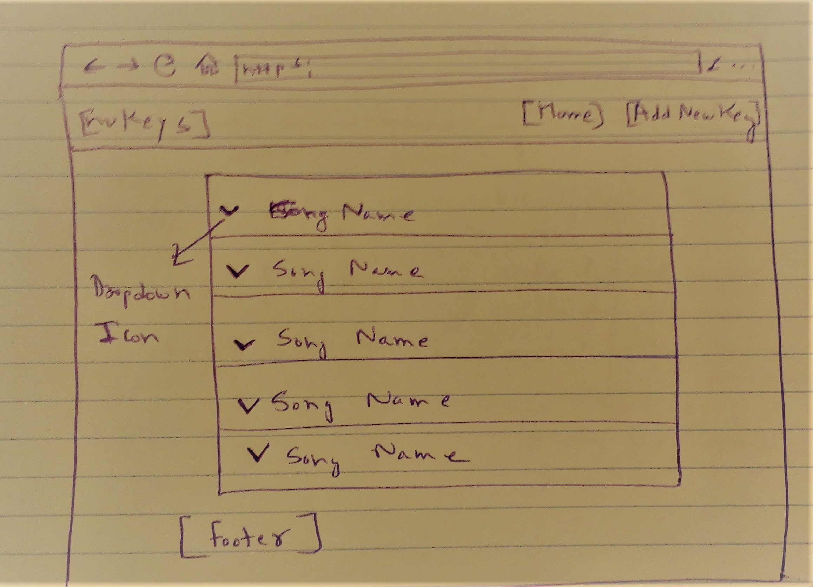
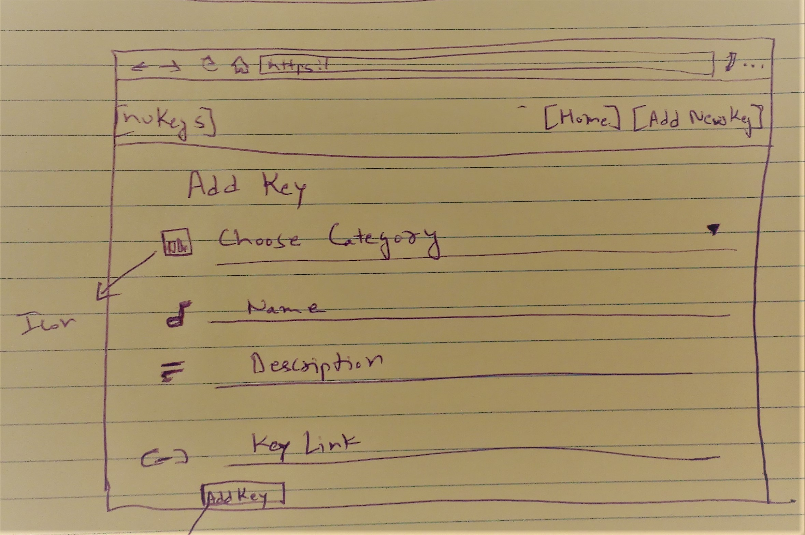

# nuKeys
Share and Discover Underground Music || Click here for [Demo](https://nukeys.herokuapp.com/)

Data Centric Development Milestone Project  - Code Institute

# UX

This application aims to show underground/undiscovered Music and Artists. Being a music enthusiast I have
created this application and also shared some songs that I have researched so far. Through this application
I would also like to encourage others that if anyone likes a music artist or a song which has not achieved 
much popularity in world yet then please add that music here.
 
 - Wireframes
  - Home
    
    
  - Submit Page
    
    
    
    
    
# Features

- Interactive Dashboard
  - Navbar - Consists of Links to Homepage and Add new song.
  - Home - Home page displays list of all updated songs.
  
- Song Info - On dropdown click user gets song's information including it's Genre and Artist.

- Link - On click user gets directed to new page.

- Add new song - User or artist can add his/her discovery or creation.

# Technologies Used

- Visula Studio Code IDE
   - This project used Visual Studio Code IDE to construct the code end to end.
   
- Flask
   - This project uses Flask, a Python micro-framework. It is classified as a microframework because it does not require particular          tools or libraries.
   
- MongoDB
   - This project uses mongoDB, a free and open-source cross-platform document-oriented database program. Classified as a NoSQL              database program, MongoDB uses JSON-like documents with schemata.

- Python
   - This project uses Python, an interpreted high-level programming language for general-purpose programming and used to write the          logic of this app, which is included within .py files.

- HTML
   - This project uses HTML, the standard mark-up language used to build website layout, which is included within the .html files.

- CSS
   - This project uses CSS, a style sheet language, used to add styling to a website. The custom.css file was added to this project, to      add additional styling on top of the Bootstrap template.

- JavaScript
   - This project uses JavaScript, an object-oriented programming language used to create interactive effects within web browsers.      

- Chrome Dev Tools
   - This project uses Chrome Dev Tools, a set of web developer tools, to continuously test and inspect that the web pages are rendering     as intended within the browser.
   
- GitHub
   - This project uses GitHub, a web hosting service, for version control and final project backup.

- Heroku
   - This project uses Heroku, a web hosting service that supports Python applications, for final project deployment.

- Font Awesome
   - This project uses Font Awesome, vector icons and social logos on the website.

- Materialize CSS
   - Created and designed by Google, Material Design is a design language that combines the classic principles of successful design          along with innovation and technology. Google's goal is to develop a system of design that allows for a unified user experience          across all their products on any platform

# Testing
 
The site was tested across multiple browsers (Chrome, Safari, Internet Explorer, FireFox) and on multiple mobile devices (iPhone 4, 5, 7: Chrome and Safari, iPad, Samsung Galaxy) to ensure compatibility and responsiveness.

# Deployment

The following section describes the process to deploy this project to Heroku.
  1. Ensure all required technologies are installed locally, as per the requirements.txtfile.
  2. Via Linux Terminal, login to Heroku, using 'heroku login' command. Input Heroku login details.
  3. Create new Heroku app, using 'heroku apps:create appname' command.
  4. Push project to Heroku, using 'push -u heroku master' command.
  5. Create scale, using 'heroku ps:scale web=1' command.
  6. Login to Heroku and select newly created app.
  7. Select settings. Select ‘Reveal Config'. Add IP 0.0.0.0 and PORT 5000.
  8. View app: In settings, select Domain URL, NOT Git URL to view your hosted application.
  9. Deployed via Heroku: https://nukeys.herokuapp.com/
